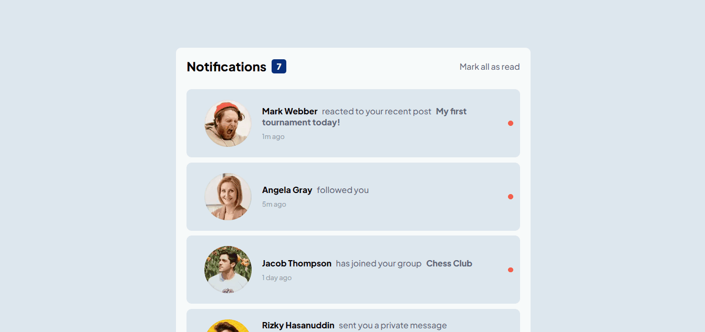
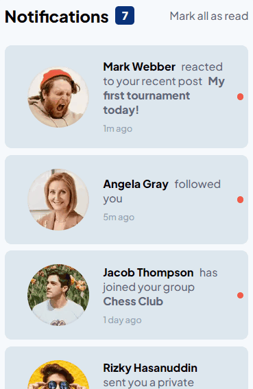

# Desafio Página de Notificações - Frontend-Mentor

Este é um desafio de uma página de notificações, proposto pelo site Frontend Mentor.

## Tabela de Conteúdos

- [Visão Geral](#visão-geral)
    - [Imagens](#imagens)
    - [Link da página](#link)
- [Processo](#processo)
    - [Linguagens utilizadas](#linguagens-utilizadas)
    - [O que aprendi](#o-que-aprendi)
    - [Possíveis evoluções](#possíveis-evoluções)
- [Autor](#autor)

## Visão-geral

### Imagens

<br>

````
Versão de Desktop
````

   

<br>

````
Versão Mobile
````

 

### Link

- Página no GitHub Pages: <a href="https://julio-mansan2.github.io/pagina-de-notificacoes">Clique aqui!</a>

## Processo

### Linguagens utilizadas

<br>

- Marcações semânticas de HTML5
- Propriedades de customização do CSS3
- Estruturas de JavaScript

<br>

### O que aprendi

<br>

- Marcar notificações como lidas:

````html

<div>
    <h1>Notifications</h1>
    <span class="notifications-quantity">7</span>
</div>
<label for="radio">Mark all as read</label>
<input type="radio" name="" id="radio">

````

````javascript

const radio = document.getElementById('radio')
const notification = document.querySelectorAll('.notification')
const notificationLog = document.querySelector('.notifications-quantity')
const circle = document.querySelectorAll('.circle')

radio.addEventListener('click', function () {
    for (let i = 0; i < notification.length; i++) {
        if (radio.checked) {
            notification[i].classList.remove('new')
            notificationLog.classList.add('read')
            circle[i].classList.add('read')
        }
    }
})

````
<br>

### Possíveis evoluções

<br>

- Códigos mais compactos;
- Configurar melhor a dimensão das imagens;
- Utilizar after para a criação do círculo das notificações.

<br>

## Autor

GitHub - <a href="https://github.com/julio-mansan2">julio-mansan2</a> <br>
Front-end Mentor - <a href="https://www.frontendmentor.io/profile/julio-mansan2">julio-mansan2</a> <br>
LinkedIn - <a href="https://www.linkedin.com/in/j%C3%BAlio-a-mansan-3415a7249/">Júlio A.</a> <br>